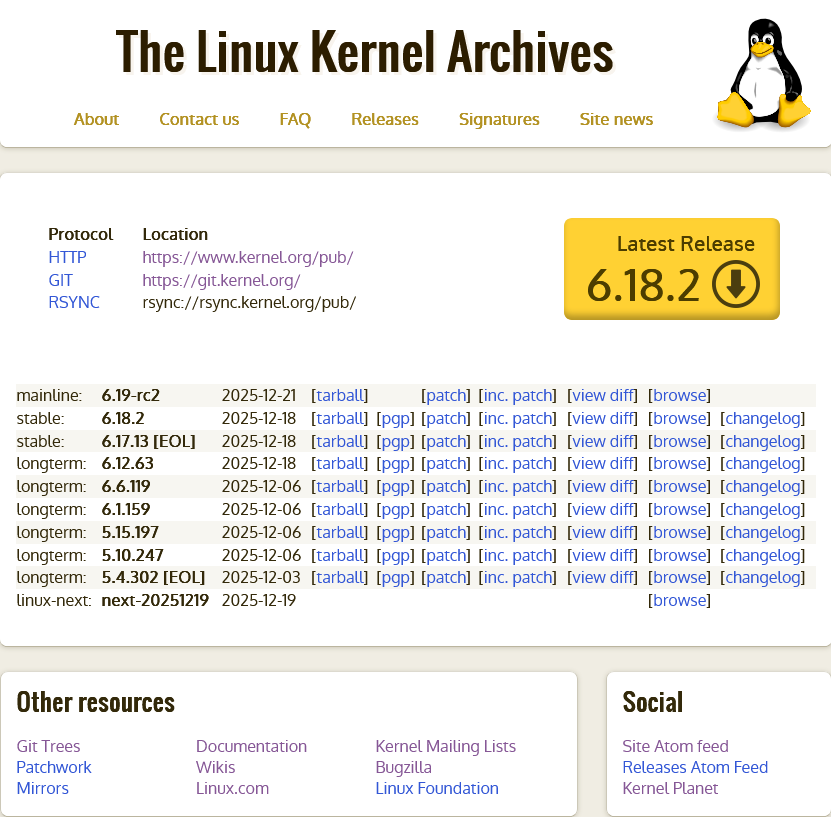
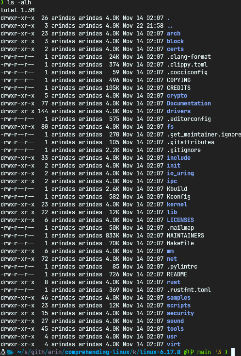

# Environment Setup

In order to do Linux kernel development... we need a Linux environment! Here's how to achieve this:

- For Windows, leverage `WSL2` or install Linux via Oracle VirtualBox
- For macOS, use virtualization solutions like Oracle VirtualBox, Parallels, or UTM to run Linux

> `WSL2` itself is a purpose built [`Hyper-V`](https://learn.microsoft.com/en-us/windows-server/virtualization/hyper-v/hyper-v-overview?pivots=windows)
> virtual machine that runs a full Linux kernel. It uses the [`9p`](https://docs.kernel.org/filesystems/9p.html)
> protocol to share both the Linux guest file system (usually `ext4`) and host Windows file system (`NTFS`) in
> a common view. The guest filesystem is mounted on a growable virtual hard disk (`VHD`) file on the host Windows
> file system. This setup allows near native Linux performance with `WSL2` with some performance overhead due to
> the storage virtualization.

If you are already using Linux as your host system, no need to install VirtualBox.

Let's proceed to installing the required packages in our Linux environment.

## Dependencies description

Now based on your distribution, install the required packages:

- compilers, debuggers and build tools (`gcc`, `gdb`, `make`, `flex`, `bison`)
- [`ncurses`](https://en.wikipedia.org/wiki/Ncurses) lib for terminal menu (`libncurses-dev` or `ncurses`)
- HTTP clients to download files (`curl`, `wget`)
- `libssl` for cryptographic routines (`libssl-dev` and/or `openssl`)
- `libelf` for working with [ELF](https://en.wikipedia.org/wiki/Executable_and_Linkable_Format) binaries (`libelf-dev` or `libelf`)
- `tar` for working with archives
- `git`: source code version control used by Linux
- `bc`: required for some kernel configuraton scripts
- Debugging with `pahole` (`dwarves` or `pahole`)
- `cpio` for creating [`initramfs`](https://docs.kernel.org/filesystems/ramfs-rootfs-initramfs.html#what-is-initramfs) (pronounced _init - ram - eff - ess_)
- A virtualization solution for running our kernel build: [`qemu`](https://www.qemu.org/)
  > Yes, we will run a VM inside a VM if need be. Installing a kernel build directly on
  > our working environment is not recommended.
- An editor. Use whatever you prefer (try something terminal based: `nano`, `vi`, `vim`, `neovim` ...)
- [`tmux`](https://github.com/tmux/tmux/wiki/Getting-Started) our terminal multiplexer. Here's a keybinds [cheatsheet](https://tmuxcheatsheet.com/)
- [`bear`](https://github.com/rizsotto/Bear) a tool that generates a compilation database for clang tooling.

## Installing Dependencies

For Debian/Ubuntu based distributions:

```bash
sudo apt install gcc gdb make flex bison \
    libncurses-dev \
    curl wget \
    openssl libssl-dev \
    libelf-dev \
    tar \
    git \
    bc \
    dwarves \
    cpio \
    qemu-system-x86 \
    nano \
    tmux \
    bear
```

For Arch Linux and derivatives (e.g. Endeavour OS, Manjaro):

```bash
sudo pacman -Sy gcc gdb make flex bison \
    ncurses \
    curl wget \
    openssl \
    libelf \
    tar \
    git \
    bc \
    pahole \
    cpio \
    qemu-system-x86 \
    nano \
    tmux \
    bear
```

## Grabbing our kernel sources

Next, let's grab our linux kernel. Goto <https://www.kernel.org> and right click and copy the link from the
**big yellow button**. That's the stable release. At the time of writing (2025-12-25) it's `6.18.2`

<p align="center">

</p>

Download it to your workspace with `wget`. Then extract with `tar`

```bash
#/bin/bash

VERSION="6.18.2"
mkdir kernel-workspace
pushd kernel-workspace

wget "https://cdn.kernel.org/pub/linux/kernel/v6.x/linux-${VERSION}.tar.xz"

tar xf linux-${VERSION}.tar.xz
rm linux-${VERSION}.tar.xz
pushd linux-${VERSION}
```

You may need to update the download link, archive name and folder name for the commands.

Your Linux source tree should look something like this:

<p align="center">

</p>

Our environment is ready! Let's proceed to building our kernel.
