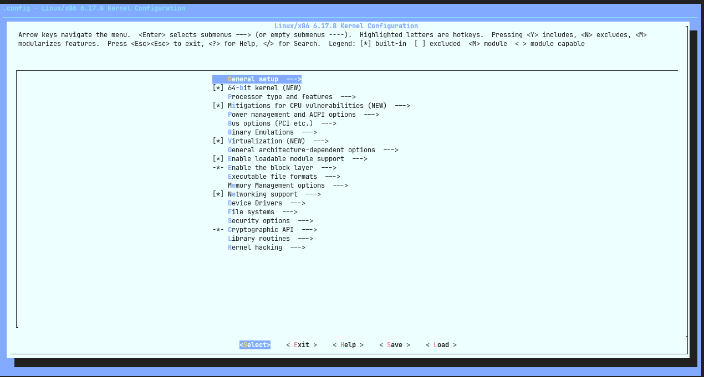
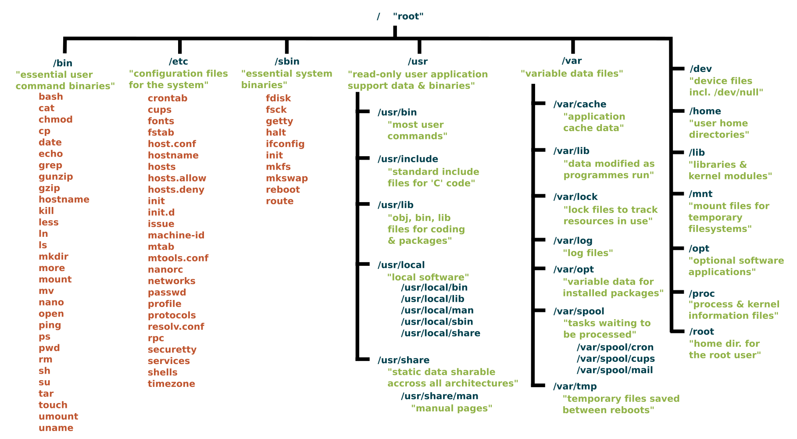
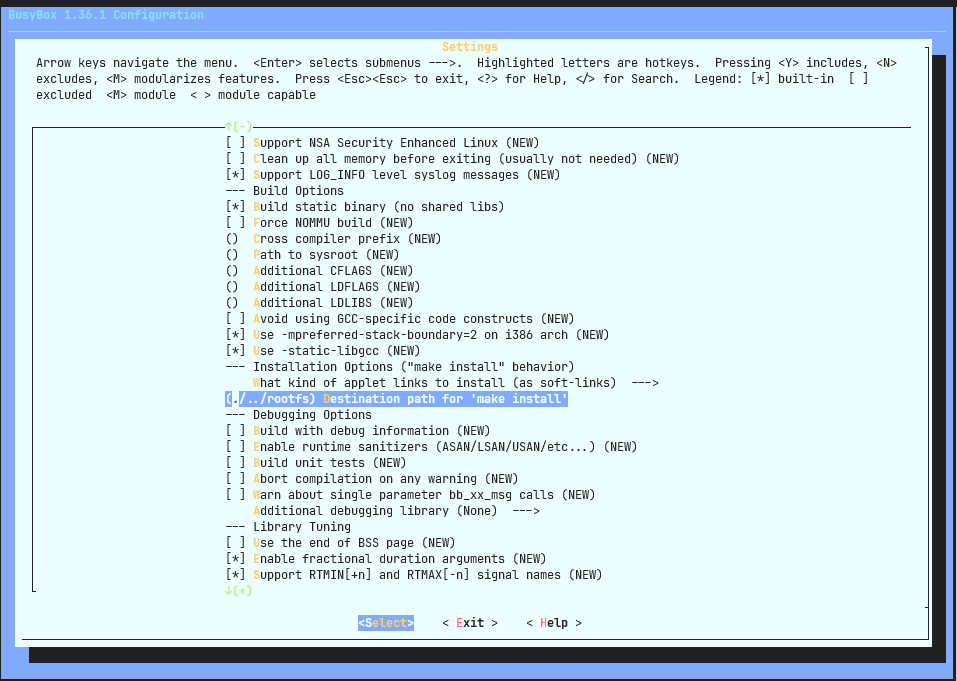

# Build and boot kernel

## Build kernel from source

From inside the kernel source directory:

```bash
make menuconfig
```

This should open up a terminal dialog menu:

<p align="center">

</p>

Take your time to explore this menu. Once you are done, exit without saving.
We will investigate these options in detail in subsequent sections.

Next, we will use the default `x86_64` config:

```bash
make x86_64_defconfig
```

> For other architectures, look for `${arch}_defconfig`

We will also enable kvm_guest.config since we intend to run it inside QEMU with KVM acceleration.

```bash
make kvm_guest.config
```

Now build the kernel:

```bash
make -j$(nproc)
```

> The `-j` flag specifies the number of parallel jobs to use for running make tasks.
> `nproc` outputs the number of processors on a system. So `-j$(nproc)` means use as
> many parallel jobs as the number of processors.
>
> In practice, if you are on a desktop, you probably don't want to go upto 100% CPU
> <usage on all cores. You can manually specify a lower number. For instance on a
> 16 core system I use -j12 to keep 4 cores free.

This should produce a kernel image:

```
Kernel: arch/x86/boot/bzImage is ready  (#1)
```

## Kernel boot attempt `#0`

Let's run this kernel image with QEMU:

```bash
popd

qemu-system-x86_64 \
  -kernel linux-6.17.8/arch/x86/boot/bzImage \
  -append "console=ttyS0" \
  -nographic
```

<details>
<summary>
Kernel Log on boot in QEMU (expand to see full)
</summary>

```
SeaBIOS (version 1.15.0-1)


iPXE (https://ipxe.org) 00:03.0 CA00 PCI2.10 PnP PMM+07F8B340+07ECB340 CA00


Booting from ROM..
[    0.000000] Linux version 6.17.8 (arindas@arubox) (gcc (Ubuntu 11.4.0-1ubuntu1~22.04.2) 11.4.0, GNU ld (GNU Binutils for Ubuntu) 2.38) #1 SMP PREEMPT_DYNAMIC Sat Nov 22 22:26:425
[    0.000000] Command line: console=ttyS0
[    0.000000] BIOS-provided physical RAM map:
[    0.000000] BIOS-e820: [mem 0x0000000000000000-0x000000000009fbff] usable
[    0.000000] BIOS-e820: [mem 0x000000000009fc00-0x000000000009ffff] reserved
[    0.000000] BIOS-e820: [mem 0x00000000000f0000-0x00000000000fffff] reserved
[    0.000000] BIOS-e820: [mem 0x0000000000100000-0x0000000007fdffff] usable
[    0.000000] BIOS-e820: [mem 0x0000000007fe0000-0x0000000007ffffff] reserved
[    0.000000] BIOS-e820: [mem 0x00000000fffc0000-0x00000000ffffffff] reserved
[    0.000000] NX (Execute Disable) protection: active
[    0.000000] APIC: Static calls initialized
[    0.000000] SMBIOS 2.8 present.
[    0.000000] DMI: QEMU Standard PC (i440FX + PIIX, 1996), BIOS 1.15.0-1 04/01/2014
[    0.000000] DMI: Memory slots populated: 1/1
[    0.000000] tsc: Fast TSC calibration using PIT
[    0.000000] tsc: Detected 2854.028 MHz processor
[    0.008310] last_pfn = 0x7fe0 max_arch_pfn = 0x400000000
[    0.008841] MTRR map: 4 entries (3 fixed + 1 variable; max 19), built from 8 variable MTRRs
[    0.008972] x86/PAT: Configuration [0-7]: WB  WC  UC- UC  WB  WP  UC- WT
[    0.019644] found SMP MP-table at [mem 0x000f5ba0-0x000f5baf]
[    0.023565] ACPI: Early table checksum verification disabled
[    0.023907] ACPI: RSDP 0x00000000000F59E0 000014 (v00 BOCHS )
[    0.024170] ACPI: RSDT 0x0000000007FE1905 000034 (v01 BOCHS  BXPC     00000001 BXPC 00000001)
[    0.025874] ACPI: FACP 0x0000000007FE17B9 000074 (v01 BOCHS  BXPC     00000001 BXPC 00000001)
[    0.026451] ACPI: DSDT 0x0000000007FE0040 001779 (v01 BOCHS  BXPC     00000001 BXPC 00000001)
[    0.026527] ACPI: FACS 0x0000000007FE0000 000040
[    0.026564] ACPI: APIC 0x0000000007FE182D 000078 (v01 BOCHS  BXPC     00000001 BXPC 00000001)
[    0.026580] ACPI: HPET 0x0000000007FE18A5 000038 (v01 BOCHS  BXPC     00000001 BXPC 00000001)
[    0.026594] ACPI: WAET 0x0000000007FE18DD 000028 (v01 BOCHS  BXPC     00000001 BXPC 00000001)
[    0.026668] ACPI: Reserving FACP table memory at [mem 0x7fe17b9-0x7fe182c]
[    0.026693] ACPI: Reserving DSDT table memory at [mem 0x7fe0040-0x7fe17b8]
[    0.026698] ACPI: Reserving FACS table memory at [mem 0x7fe0000-0x7fe003f]
[    0.026702] ACPI: Reserving APIC table memory at [mem 0x7fe182d-0x7fe18a4]
[    0.026706] ACPI: Reserving HPET table memory at [mem 0x7fe18a5-0x7fe18dc]
[    0.026710] ACPI: Reserving WAET table memory at [mem 0x7fe18dd-0x7fe1904]
[    0.028386] No NUMA configuration found
[    0.028404] Faking a node at [mem 0x0000000000000000-0x0000000007fdffff]
[    0.028946] NODE_DATA(0) allocated [mem 0x07fdc900-0x07fdffff]
[    0.030460] Zone ranges:
[    0.030479]   DMA      [mem 0x0000000000001000-0x0000000000ffffff]
[    0.030532]   DMA32    [mem 0x0000000001000000-0x0000000007fdffff]
[    0.030539]   Normal   empty
[    0.030556] Movable zone start for each node
[    0.030575] Early memory node ranges
[    0.030598]   node   0: [mem 0x0000000000001000-0x000000000009efff]
[    0.030726]   node   0: [mem 0x0000000000100000-0x0000000007fdffff]
[    0.030822] Initmem setup node 0 [mem 0x0000000000001000-0x0000000007fdffff]
[    0.032641] On node 0, zone DMA: 1 pages in unavailable ranges
[    0.032867] On node 0, zone DMA: 97 pages in unavailable ranges
[    0.033417] On node 0, zone DMA32: 32 pages in unavailable ranges
[    0.033762] ACPI: PM-Timer IO Port: 0x608
[    0.034131] ACPI: LAPIC_NMI (acpi_id[0xff] dfl dfl lint[0x1])
[    0.034440] IOAPIC[0]: apic_id 0, version 32, address 0xfec00000, GSI 0-23
[    0.034543] ACPI: INT_SRC_OVR (bus 0 bus_irq 0 global_irq 2 dfl dfl)
[    0.034747] ACPI: INT_SRC_OVR (bus 0 bus_irq 5 global_irq 5 high level)
[    0.034776] ACPI: INT_SRC_OVR (bus 0 bus_irq 9 global_irq 9 high level)
[    0.034837] ACPI: INT_SRC_OVR (bus 0 bus_irq 10 global_irq 10 high level)
[    0.034843] ACPI: INT_SRC_OVR (bus 0 bus_irq 11 global_irq 11 high level)
[    0.035026] ACPI: Using ACPI (MADT) for SMP configuration information
[    0.035070] ACPI: HPET id: 0x8086a201 base: 0xfed00000
[    0.035375] CPU topo: Max. logical packages:   1
[    0.035386] CPU topo: Max. logical dies:       1
[    0.035393] CPU topo: Max. dies per package:   1
[    0.035441] CPU topo: Max. threads per core:   1
[    0.035565] CPU topo: Num. cores per package:     1
[    0.035576] CPU topo: Num. threads per package:   1
[    0.035582] CPU topo: Allowing 1 present CPUs plus 0 hotplug CPUs
[    0.036250] PM: hibernation: Registered nosave memory: [mem 0x00000000-0x00000fff]
[    0.036278] PM: hibernation: Registered nosave memory: [mem 0x0009f000-0x000fffff]
[    0.036370] [mem 0x08000000-0xfffbffff] available for PCI devices
[    0.036407] Booting paravirtualized kernel on bare hardware
[    0.036624] clocksource: refined-jiffies: mask: 0xffffffff max_cycles: 0xffffffff, max_idle_ns: 1910969940391419 ns
[    0.046590] setup_percpu: NR_CPUS:64 nr_cpumask_bits:1 nr_cpu_ids:1 nr_node_ids:1
[    0.048777] percpu: Embedded 52 pages/cpu s172312 r8192 d32488 u2097152
[    0.050379] Kernel command line: console=ttyS0
[    0.051117] printk: log buffer data + meta data: 262144 + 917504 = 1179648 bytes
[    0.054547] Dentry cache hash table entries: 16384 (order: 5, 131072 bytes, linear)
[    0.057473] Inode-cache hash table entries: 8192 (order: 4, 65536 bytes, linear)
[    0.060090] Fallback order for Node 0: 0
[    0.060333] Built 1 zonelists, mobility grouping on.  Total pages: 32638
[    0.060347] Policy zone: DMA32
[    0.060527] mem auto-init: stack:off, heap alloc:off, heap free:off
[    0.066864] SLUB: HWalign=64, Order=0-3, MinObjects=0, CPUs=1, Nodes=1
[    0.079172] Dynamic Preempt: voluntary
[    0.082927] rcu: Preemptible hierarchical RCU implementation.
[    0.082943] rcu:     RCU event tracing is enabled.
[    0.082963] rcu:     RCU restricting CPUs from NR_CPUS=64 to nr_cpu_ids=1.
[    0.083094]  Trampoline variant of Tasks RCU enabled.
[    0.083101]  Tracing variant of Tasks RCU enabled.
[    0.083167] rcu: RCU calculated value of scheduler-enlistment delay is 100 jiffies.
[    0.083188] rcu: Adjusting geometry for rcu_fanout_leaf=16, nr_cpu_ids=1
[    0.084158] RCU Tasks: Setting shift to 0 and lim to 1 rcu_task_cb_adjust=1 rcu_task_cpu_ids=1.
[    0.084176] RCU Tasks Trace: Setting shift to 0 and lim to 1 rcu_task_cb_adjust=1 rcu_task_cpu_ids=1.
[    0.104711] NR_IRQS: 4352, nr_irqs: 256, preallocated irqs: 16
[    0.112434] rcu: srcu_init: Setting srcu_struct sizes based on contention.
[    0.117066] Console: colour VGA+ 80x25
[    0.118722] printk: legacy console [ttyS0] enabled
[    0.154279] ACPI: Core revision 20250404
[    0.160618] clocksource: hpet: mask: 0xffffffff max_cycles: 0xffffffff, max_idle_ns: 19112604467 ns
[    0.165197] APIC: Switch to symmetric I/O mode setup
[    0.169443] ..TIMER: vector=0x30 apic1=0 pin1=2 apic2=-1 pin2=-1
[    0.175382] clocksource: tsc-early: mask: 0xffffffffffffffff max_cycles: 0x29239f42fee, max_idle_ns: 440795314463 ns
[    0.176374] Calibrating delay loop (skipped), value calculated using timer frequency.. 5708.05 BogoMIPS (lpj=2854028)
[    0.179979] Last level iTLB entries: 4KB 512, 2MB 255, 4MB 127
[    0.180152] Last level dTLB entries: 4KB 512, 2MB 255, 4MB 127, 1GB 0
[    0.181427] mitigations: Enabled attack vectors: user_kernel, user_user, SMT mitigations: auto
[    0.182456] Spectre V2 : Mitigation: Retpolines
[    0.182920] Spectre V1 : Mitigation: usercopy/swapgs barriers and __user pointer sanitization
[    0.183321] Spectre V2 : Spectre v2 / SpectreRSB: Filling RSB on context switch and VMEXIT
[    0.184840] x86/fpu: x87 FPU will use FXSAVE
[    0.582152] Freeing SMP alternatives memory: 52K
[    0.583226] pid_max: default: 32768 minimum: 301
[    0.588197] LSM: initializing lsm=capability,selinux
[    0.590247] SELinux:  Initializing.
[    0.595424] Mount-cache hash table entries: 512 (order: 0, 4096 bytes, linear)
[    0.595900] Mountpoint-cache hash table entries: 512 (order: 0, 4096 bytes, linear)
[    0.728144] smpboot: CPU0: AMD QEMU Virtual CPU version 2.5+ (family: 0xf, model: 0x6b, stepping: 0x1)
[    0.737315] Performance Events: PMU not available due to virtualization, using software events only.
[    0.738634] signal: max sigframe size: 1440
[    0.741693] rcu: Hierarchical SRCU implementation.
[    0.741992] rcu:     Max phase no-delay instances is 400.
[    0.747764] smp: Bringing up secondary CPUs ...
[    0.750000] smp: Brought up 1 node, 1 CPU
[    0.750546] smpboot: Total of 1 processors activated (5708.05 BogoMIPS)
[    0.757779] Memory: 86108K/130552K available (18357K kernel code, 2889K rwdata, 7320K rodata, 2868K init, 676K bss, 42068K reserved, 0K cma-reserved)
[    0.765495] devtmpfs: initialized
[    0.778276] clocksource: jiffies: mask: 0xffffffff max_cycles: 0xffffffff, max_idle_ns: 1911260446275000 ns
[    0.780163] posixtimers hash table entries: 512 (order: 1, 8192 bytes, linear)
[    0.780912] futex hash table entries: 256 (16384 bytes on 1 NUMA nodes, total 16 KiB, linear).
[    0.784679] PM: RTC time: 17:08:35, date: 2025-11-22
[    0.789524] NET: Registered PF_NETLINK/PF_ROUTE protocol family
[    0.792877] audit: initializing netlink subsys (disabled)
[    0.795710] audit: type=2000 audit(1763831314.629:1): state=initialized audit_enabled=0 res=1
[    0.799779] thermal_sys: Registered thermal governor 'step_wise'
[    0.800447] cpuidle: using governor menu
[    0.804498] PCI: Using configuration type 1 for base access
[    0.807023] kprobes: kprobe jump-optimization is enabled. All kprobes are optimized if possible.
[    0.812272] HugeTLB: registered 2.00 MiB page size, pre-allocated 0 pages
[    0.812699] HugeTLB: 28 KiB vmemmap can be freed for a 2.00 MiB page
[    0.821937] ACPI: Added _OSI(Module Device)
[    0.823182] ACPI: Added _OSI(Processor Device)
[    0.823450] ACPI: Added _OSI(Processor Aggregator Device)
[    0.861771] ACPI: 1 ACPI AML tables successfully acquired and loaded
[    0.895558] ACPI: Interpreter enabled
[    0.898764] ACPI: PM: (supports S0 S3 S4 S5)
[    0.899027] ACPI: Using IOAPIC for interrupt routing
[    0.904500] PCI: Using host bridge windows from ACPI; if necessary, use "pci=nocrs" and report a bug
[    0.904965] PCI: Using E820 reservations for host bridge windows
[    0.906610] ACPI: Enabled 2 GPEs in block 00 to 0F
[    0.983459] ACPI: PCI Root Bridge [PCI0] (domain 0000 [bus 00-ff])
[    0.984395] acpi PNP0A03:00: _OSC: OS supports [ASPM ClockPM Segments MSI HPX-Type3]
[    0.984963] acpi PNP0A03:00: _OSC: not requesting OS control; OS requires [ExtendedConfig ASPM ClockPM MSI]
[    0.993171] acpi PNP0A03:00: fail to add MMCONFIG information, can't access extended configuration space under this bridge
[    0.996864] PCI host bridge to bus 0000:00
[    0.997303] pci_bus 0000:00: root bus resource [io  0x0000-0x0cf7 window]
[    0.997769] pci_bus 0000:00: root bus resource [io  0x0d00-0xffff window]
[    0.998146] pci_bus 0000:00: root bus resource [mem 0x000a0000-0x000bffff window]
[    0.998733] pci_bus 0000:00: root bus resource [mem 0x08000000-0xfebfffff window]
[    0.999152] pci_bus 0000:00: root bus resource [mem 0x100000000-0x17fffffff window]
[    1.004734] pci_bus 0000:00: root bus resource [bus 00-ff]
[    1.006277] pci 0000:00:00.0: [8086:1237] type 00 class 0x060000 conventional PCI endpoint
[    1.025854] pci 0000:00:01.0: [8086:7000] type 00 class 0x060100 conventional PCI endpoint
[    1.027321] pci 0000:00:01.1: [8086:7010] type 00 class 0x010180 conventional PCI endpoint
[    1.028371] pci 0000:00:01.1: BAR 4 [io  0xc040-0xc04f]
[    1.029292] pci 0000:00:01.1: BAR 0 [io  0x01f0-0x01f7]: legacy IDE quirk
[    1.030210] pci 0000:00:01.1: BAR 1 [io  0x03f6]: legacy IDE quirk
[    1.030502] pci 0000:00:01.1: BAR 2 [io  0x0170-0x0177]: legacy IDE quirk
[    1.031216] pci 0000:00:01.1: BAR 3 [io  0x0376]: legacy IDE quirk
[    1.038455] pci 0000:00:01.3: [8086:7113] type 00 class 0x068000 conventional PCI endpoint
[    1.039187] pci 0000:00:01.3: quirk: [io  0x0600-0x063f] claimed by PIIX4 ACPI
[    1.039551] pci 0000:00:01.3: quirk: [io  0x0700-0x070f] claimed by PIIX4 SMB
[    1.040434] pci 0000:00:02.0: [1234:1111] type 00 class 0x030000 conventional PCI endpoint
[    1.041604] pci 0000:00:02.0: BAR 0 [mem 0xfd000000-0xfdffffff pref]
[    1.042235] pci 0000:00:02.0: BAR 2 [mem 0xfebb0000-0xfebb0fff]
[    1.043197] pci 0000:00:02.0: ROM [mem 0xfeba0000-0xfebaffff pref]
[    1.048587] pci 0000:00:02.0: Video device with shadowed ROM at [mem 0x000c0000-0x000dffff]
[    1.059955] pci 0000:00:03.0: [8086:100e] type 00 class 0x020000 conventional PCI endpoint
[    1.061195] pci 0000:00:03.0: BAR 0 [mem 0xfeb80000-0xfeb9ffff]
[    1.062190] pci 0000:00:03.0: BAR 1 [io  0xc000-0xc03f]
[    1.062548] pci 0000:00:03.0: ROM [mem 0xfeb00000-0xfeb7ffff pref]
[    1.082406] ACPI: PCI: Interrupt link LNKA configured for IRQ 10
[    1.083794] ACPI: PCI: Interrupt link LNKB configured for IRQ 10
[    1.090600] ACPI: PCI: Interrupt link LNKC configured for IRQ 11
[    1.091817] ACPI: PCI: Interrupt link LNKD configured for IRQ 11
[    1.092873] ACPI: PCI: Interrupt link LNKS configured for IRQ 9
[    1.101421] iommu: Default domain type: Translated
[    1.101751] iommu: DMA domain TLB invalidation policy: lazy mode
[    1.103586] SCSI subsystem initialized
[    1.109413] ACPI: bus type USB registered
[    1.110036] usbcore: registered new interface driver usbfs
[    1.110559] usbcore: registered new interface driver hub
[    1.115323] usbcore: registered new device driver usb
[    1.115971] pps_core: LinuxPPS API ver. 1 registered
[    1.116235] pps_core: Software ver. 5.3.6 - Copyright 2005-2007 Rodolfo Giometti <giometti@linux.it>
[    1.117352] PTP clock support registered
[    1.124303] Advanced Linux Sound Architecture Driver Initialized.
[    1.138947] NetLabel: Initializing
[    1.139194] NetLabel:  domain hash size = 128
[    1.139356] NetLabel:  protocols = UNLABELED CIPSOv4 CALIPSO
[    1.145485] NetLabel:  unlabeled traffic allowed by default
[    1.155566] PCI: Using ACPI for IRQ routing
[    1.158449] pci 0000:00:02.0: vgaarb: setting as boot VGA device
[    1.158866] pci 0000:00:02.0: vgaarb: bridge control possible
[    1.159152] pci 0000:00:02.0: vgaarb: VGA device added: decodes=io+mem,owns=io+mem,locks=none
[    1.160248] vgaarb: loaded
[    1.168212] hpet: 3 channels of 0 reserved for per-cpu timers
[    1.168723] hpet0: at MMIO 0xfed00000, IRQs 2, 8, 0
[    1.169106] hpet0: 3 comparators, 64-bit 100.000000 MHz counter
[    1.178034] clocksource: Switched to clocksource tsc-early
[    1.183549] VFS: Disk quotas dquot_6.6.0
[    1.183822] VFS: Dquot-cache hash table entries: 512 (order 0, 4096 bytes)
[    1.197017] pnp: PnP ACPI init
[    1.213182] pnp: PnP ACPI: found 6 devices
[    1.261062] clocksource: acpi_pm: mask: 0xffffff max_cycles: 0xffffff, max_idle_ns: 2085701024 ns
[    1.271024] NET: Registered PF_INET protocol family
[    1.272330] IP idents hash table entries: 2048 (order: 2, 16384 bytes, linear)
[    1.284107] tcp_listen_portaddr_hash hash table entries: 256 (order: 0, 4096 bytes, linear)
[    1.284963] Table-perturb hash table entries: 65536 (order: 6, 262144 bytes, linear)
[    1.291548] TCP established hash table entries: 1024 (order: 1, 8192 bytes, linear)
[    1.293492] TCP bind hash table entries: 1024 (order: 3, 32768 bytes, linear)
[    1.294018] TCP: Hash tables configured (established 1024 bind 1024)
[    1.295214] UDP hash table entries: 256 (order: 2, 16384 bytes, linear)
[    1.296036] UDP-Lite hash table entries: 256 (order: 2, 16384 bytes, linear)
[    1.301662] NET: Registered PF_UNIX/PF_LOCAL protocol family
[    1.305639] RPC: Registered named UNIX socket transport module.
[    1.305970] RPC: Registered udp transport module.
[    1.306146] RPC: Registered tcp transport module.
[    1.306363] RPC: Registered tcp-with-tls transport module.
[    1.306751] RPC: Registered tcp NFSv4.1 backchannel transport module.
[    1.317517] pci_bus 0000:00: resource 4 [io  0x0000-0x0cf7 window]
[    1.317853] pci_bus 0000:00: resource 5 [io  0x0d00-0xffff window]
[    1.318079] pci_bus 0000:00: resource 6 [mem 0x000a0000-0x000bffff window]
[    1.318382] pci_bus 0000:00: resource 7 [mem 0x08000000-0xfebfffff window]
[    1.319170] pci_bus 0000:00: resource 8 [mem 0x100000000-0x17fffffff window]
[    1.323899] pci 0000:00:01.0: PIIX3: Enabling Passive Release
[    1.324345] pci 0000:00:00.0: Limiting direct PCI/PCI transfers
[    1.325744] PCI: CLS 0 bytes, default 64
[    1.505527] Initialise system trusted keyrings
[    1.510802] workingset: timestamp_bits=56 max_order=15 bucket_order=0
[    1.514626] NFS: Registering the id_resolver key type
[    1.515167] Key type id_resolver registered
[    1.515494] Key type id_legacy registered
[    1.517687] 9p: Installing v9fs 9p2000 file system support
[    1.598356] Key type asymmetric registered
[    1.599073] Asymmetric key parser 'x509' registered
[    1.600579] Block layer SCSI generic (bsg) driver version 0.4 loaded (major 251)
[    1.602124] io scheduler mq-deadline registered
[    1.602742] io scheduler kyber registered
[    1.605907] input: Power Button as /devices/LNXSYSTM:00/LNXPWRBN:00/input/input0
[    1.610368] ACPI: button: Power Button [PWRF]
[    1.613808] Serial: 8250/16550 driver, 4 ports, IRQ sharing enabled
[    1.618490] 00:04: ttyS0 at I/O 0x3f8 (irq = 4, base_baud = 115200) is a 16550A
[    1.626515] Non-volatile memory driver v1.3
[    1.626800] Linux agpgart interface v0.103
[    1.629107] ACPI: bus type drm_connector registered
[    1.650316] loop: module loaded
[    1.661112] scsi host0: ata_piix
[    1.663322] scsi host1: ata_piix
[    1.664308] ata1: PATA max MWDMA2 cmd 0x1f0 ctl 0x3f6 bmdma 0xc040 irq 14 lpm-pol 0
[    1.664919] ata2: PATA max MWDMA2 cmd 0x170 ctl 0x376 bmdma 0xc048 irq 15 lpm-pol 0
[    1.671485] e100: Intel(R) PRO/100 Network Driver
[    1.671742] e100: Copyright(c) 1999-2006 Intel Corporation
[    1.672085] e1000: Intel(R) PRO/1000 Network Driver
[    1.672356] e1000: Copyright (c) 1999-2006 Intel Corporation.
[    1.820888] ata2: found unknown device (class 0)
[    1.826967] ata2.00: ATAPI: QEMU DVD-ROM, 2.5+, max UDMA/100
[    1.847738] scsi 1:0:0:0: CD-ROM            QEMU     QEMU DVD-ROM     2.5+ PQ: 0 ANSI: 5
[    1.868691] sr 1:0:0:0: [sr0] scsi3-mmc drive: 4x/4x cd/rw xa/form2 tray
[    1.869271] cdrom: Uniform CD-ROM driver Revision: 3.20
[    1.883745] sr 1:0:0:0: Attached scsi generic sg0 type 5
[    1.897979] ACPI: \_SB_.LNKC: Enabled at IRQ 11
[    2.191208] e1000 0000:00:03.0 eth0: (PCI:33MHz:32-bit) 52:54:00:12:34:56
[    2.192015] e1000 0000:00:03.0 eth0: Intel(R) PRO/1000 Network Connection
[    2.193077] e1000e: Intel(R) PRO/1000 Network Driver
[    2.193670] e1000e: Copyright(c) 1999 - 2015 Intel Corporation.
[    2.194167] sky2: driver version 1.30
[    2.197548] usbcore: registered new interface driver usblp
[    2.197984] usbcore: registered new interface driver usb-storage
[    2.199176] i8042: PNP: PS/2 Controller [PNP0303:KBD,PNP0f13:MOU] at 0x60,0x64 irq 1,12
[    2.203113] serio: i8042 KBD port at 0x60,0x64 irq 1
[    2.203788] serio: i8042 AUX port at 0x60,0x64 irq 12
[    2.207782] rtc_cmos 00:05: RTC can wake from S4
[    2.213253] input: AT Translated Set 2 keyboard as /devices/platform/i8042/serio0/input/input1
[    2.214810] rtc_cmos 00:05: registered as rtc0
[    2.217022] rtc_cmos 00:05: alarms up to one day, y3k, 242 bytes nvram, hpet irqs
[    2.221300] device-mapper: ioctl: 4.50.0-ioctl (2025-04-28) initialised: dm-devel@lists.linux.dev
[    2.223799] amd_pstate: the _CPC object is not present in SBIOS or ACPI disabled
[    2.225005] hid: raw HID events driver (C) Jiri Kosina
[    2.227563] usbcore: registered new interface driver usbhid
[    2.227972] usbhid: USB HID core driver
[    2.235025] Initializing XFRM netlink socket
[    2.235729] NET: Registered PF_INET6 protocol family
[    2.243163] Segment Routing with IPv6
[    2.243746] In-situ OAM (IOAM) with IPv6
[    2.244970] sit: IPv6, IPv4 and MPLS over IPv4 tunneling driver
[    2.248517] NET: Registered PF_PACKET protocol family
[    2.249815] 9pnet: Installing 9P2000 support
[    2.250517] Key type dns_resolver registered
[    2.252861] IPI shorthand broadcast: enabled
[    2.280915] sched_clock: Marking stable (2229105324, 51297956)->(2288217773, -7814493)
[    2.284013] registered taskstats version 1
[    2.284281] Loading compiled-in X.509 certificates
[    2.296770] Demotion targets for Node 0: null
[    2.300100] PM:   Magic number: 1:553:138
[    2.300608] netconsole: network logging started
[    2.302265] cfg80211: Loading compiled-in X.509 certificates for regulatory database
[    2.312153] kworker/u4:0 (51) used greatest stack depth: 14384 bytes left
[    2.321843] Loaded X.509 cert 'sforshee: 00b28ddf47aef9cea7'
[    2.323122] Loaded X.509 cert 'wens: 61c038651aabdcf94bd0ac7ff06c7248db18c600'
[    2.325186] ALSA device list:
[    2.326996]   No soundcards found.
[    2.328346] faux_driver regulatory: Direct firmware load for regulatory.db failed with error -2
[    2.329253] cfg80211: failed to load regulatory.db
[    2.335519] check access for rdinit=/init failed: -2, ignoring
[    2.373674] tsc: Refined TSC clocksource calibration: 2871.622 MHz
[    2.375436] clocksource: tsc: mask: 0xffffffffffffffff max_cycles: 0x29648ba2675, max_idle_ns: 440795351814 ns
[    2.377474] clocksource: Switched to clocksource tsc
[    2.640410] input: ImExPS/2 Generic Explorer Mouse as /devices/platform/i8042/serio1/input/input3
[    2.642656] md: Waiting for all devices to be available before autodetect
[    2.643010] md: If you don't use raid, use raid=noautodetect
[    2.643373] md: Autodetecting RAID arrays.
[    2.644038] md: autorun ...
[    2.644397] md: ... autorun DONE.
[    2.647746] /dev/root: Can't open blockdev
[    2.648623] VFS: Cannot open root device "" or unknown-block(0,0): error -6
[    2.649054] Please append a correct "root=" boot option; here are the available partitions:
[    2.650159] 0b00         1048575 sr0
[    2.650267]  driver: sr
[    2.651023] List of all bdev filesystems:
[    2.651537]  ext3
[    2.651589]  ext2
[    2.651707]  ext4
[    2.651883]  vfat
[    2.652072]  msdos
[    2.652149]  iso9660
[    2.652335]
[    2.653343] Kernel panic - not syncing: VFS: Unable to mount root fs on unknown-block(0,0)
[    2.654262] CPU: 0 UID: 0 PID: 1 Comm: swapper/0 Not tainted 6.17.8 #1 PREEMPT(voluntary)
[    2.654790] Hardware name: QEMU Standard PC (i440FX + PIIX, 1996), BIOS 1.15.0-1 04/01/2014
[    2.655495] Call Trace:
[    2.656237]  <TASK>
[    2.656582]  vpanic+0x2fb/0x320
[    2.657100]  panic+0x56/0x60
[    2.657378]  mount_root_generic+0x1ff/0x320
[    2.657665]  prepare_namespace+0x63/0x270
[    2.657981]  kernel_init_freeable+0x297/0x2e0
[    2.658324]  ? __pfx_kernel_init+0x10/0x10
[    2.658516]  kernel_init+0x15/0x1c0
[    2.658744]  ret_from_fork+0xc1/0x100
[    2.658893]  ? __pfx_kernel_init+0x10/0x10
[    2.659105]  ret_from_fork_asm+0x1a/0x30
[    2.659437]  </TASK>
[    2.661105] Kernel Offset: 0x1e00000 from 0xffffffff81000000 (relocation range: 0xffffffff80000000-0xffffffffbfffffff)
[    2.661869] ---[ end Kernel panic - not syncing: VFS: Unable to mount root fs on unknown-block(0,0) ]---

```

</details>

For the time being, let's focus on the tail section of the emitted kernel log:

```
[    2.642656] md: Waiting for all devices to be available before autodetect
[    2.643010] md: If you don't use raid, use raid=noautodetect
[    2.643373] md: Autodetecting RAID arrays.
[    2.644038] md: autorun ...
[    2.644397] md: ... autorun DONE.
[    2.647746] /dev/root: Can't open blockdev
[    2.648623] VFS: Cannot open root device "" or unknown-block(0,0): error -6
[    2.649054] Please append a correct "root=" boot option; here are the available partitions:
[    2.650159] 0b00         1048575 sr0
[    2.650267]  driver: sr
[    2.651023] List of all bdev filesystems:
[    2.651537]  ext3
[    2.651589]  ext2
[    2.651707]  ext4
[    2.651883]  vfat
[    2.652072]  msdos
[    2.652149]  iso9660
[    2.652335]
[    2.653343] Kernel panic - not syncing: VFS: Unable to mount root fs on unknown-block(0,0)
[    2.654262] CPU: 0 UID: 0 PID: 1 Comm: swapper/0 Not tainted 6.17.8 #1 PREEMPT(voluntary)
[    2.654790] Hardware name: QEMU Standard PC (i440FX + PIIX, 1996), BIOS 1.15.0-1 04/01/2014
[    2.655495] Call Trace:
[    2.656237]  <TASK>
[    2.656582]  vpanic+0x2fb/0x320
[    2.657100]  panic+0x56/0x60
[    2.657378]  mount_root_generic+0x1ff/0x320
[    2.657665]  prepare_namespace+0x63/0x270
[    2.657981]  kernel_init_freeable+0x297/0x2e0
[    2.658324]  ? __pfx_kernel_init+0x10/0x10
[    2.658516]  kernel_init+0x15/0x1c0
[    2.658744]  ret_from_fork+0xc1/0x100
[    2.658893]  ? __pfx_kernel_init+0x10/0x10
[    2.659105]  ret_from_fork_asm+0x1a/0x30
[    2.659437]  </TASK>
[    2.661105] Kernel Offset: 0x1e00000 from 0xffffffff81000000 (relocation range: 0xffffffff80000000-0xffffffffbfffffff)
[    2.661869] ---[ end Kernel panic - not syncing: VFS: Unable to mount root fs on unknown-block(0,0) ]---
```

We observe the following:

- The kernel tries to detect block devices
- `VFS` (virtual file system) cannot find a block storage device to mount the root filesystem to
- `VFS` is unable to mount `rootfs`
- This leads to a kernel panic

## Build rootfs

So we need something called a root filesystem and some block storage device. But what does this mean?

> From <b>The Linux BootDisk HOWTO</b> - <i>["Building a root filesystem"](https://tldp.org/HOWTO/Bootdisk-HOWTO/buildroot.html)</i>
>
> A root filesystem must contain everything needed to support a full Linux system. To be able to do this, the disk must include the minimum requirements for a Linux system:
>
> - The basic file system structure,
> - Minimum set of directories: /dev, /proc, /bin, /etc, /lib, /usr, /tmp,
> - Basic set of utilities: sh, ls, cp, mv, etc.,
> - Minimum set of config files: rc, inittab, fstab, etc.,
> - Devices: /dev/hd*, /dev/tty*, /dev/fd0, etc.,
> - Runtime library to provide basic functions used by utilities.

<p align="center">

Fig: The Linux Filesystem Hierarchy (https://www.linuxfoundation.org)
</p>

> For more information, see [`file-hierarchy(7)`](https://man7.org/linux/man-pages/man7/file-hierarchy.7.html) on the Linux man pages.

We will create our `rootfs` with [`busybox`](https://busybox.net).

> From **`busybox`** - <i>["About Busybox"](https://busybox.net/about.html)</i>
>
> ### BusyBox: The Swiss Army Knife of Embedded Linux
>
> BusyBox combines tiny versions of many common UNIX utilities into a single small executable. It provides replacements for most of
> the utilities you usually find in GNU fileutils, shellutils, etc. The utilities in BusyBox generally have fewer options than their
> full-featured GNU cousins; however, the options that are included provide the expected functionality and behave very much like their
> GNU counterparts. BusyBox provides a fairly complete environment for any small or embedded system.
>
> BusyBox has been written with size-optimization and limited resources in mind. It is also extremely modular so you can easily
> include or exclude commands (or features) at compile time. This makes it easy to customize your embedded systems. To create a
> working system, just add some device nodes in /dev, a few configuration files in /etc, and a Linux kernel.
>
> BusyBox is maintained by Denys Vlasenko, and licensed under the GNU GENERAL PUBLIC LICENSE version 2.

`busybox` provides a single static binary with the same name, which acts as something called a "multicall" binary. Essentialy,
it used `argv[0]` i.e the first command line parameter to decide which functionality to provide. This way you can create multiple
symlinks named `mv`, `cp` etc. to the same `busybox` binary path; yet when you invoke these symlinks, they will provide their
intended unique functionality.

### Build BusyBox from source

Similar workflow to our kernel: fetch sources, extract, configure, build.

```bash
popd
wget https://busybox.net/downloads/busybox-1.36.1.tar.bz2
tar xf busybox-1.36.1.tar.bz2
pushd busybox-1.36.1
make menuconfig
```

Now select:

1. Settings
2. Enable "Build static binary (no shapred libs)" (press space)
3. Select and specify "Destination path for 'make install'" as "./../rootfs"

<p align="center">

</p>

```bash
make -j12  # use number of jobs as supported by your machine
sudo make install
popd
```

This should result in a `rootfs` directory in our `kernel-workspace` directory.

Next, let's add the missing directories and configuration for our rootfs:

```bash
pushd rootfs
sudo mkdir -p proc sys dev tmp etc
```

Next, inside the `rootfs` directory, create a new file `etc/inittab` with the following contents:

```
::sysinit:/bin/mount -t proc proc /proc
::sysinit:/bin/mount -t sysfs sysfs /sys
::sysinit:/bin/mount -t devtmpfs dev /dev

::sysinit:/sbin/ip link set eth0 up
::sysinit:/sbin/udhcpc -i eth0 -s /usr/share/udhcpc/default.script

ttyS0::respawn:/sbin/getty -n -l /bin/sh -L ttyS0 115200 vt100
```

> `/etc/inittab` is the configuration file to the `/sbin/init` init process for our `busybox` system.
>
> The init process is the first process to run on a Linux system. It has `PID = 0` (PID: process id).
>
> It is responsible for mounting file systems, setting up devices and starting system services.
>
> Let's analyse our `/etc/inittab` configuration:
>
> ```
> ::sysinit:/bin/mount -t proc proc /proc
> ::sysinit:/bin/mount -t sysfs sysfs /sys
> ::sysinit:/bin/mount -t devtmpfs dev /dev
> ```
>
> Mount `procfs`, `sysfs`, `devtmpfs`. These are psuedo filesystems that allow interacting with
> processes, system configuration and devices, respectively, via file-like interfaces.
>
> ```
> ::sysinit:/sbin/ip link set eth0 up
> ::sysinit:/sbin/udhcpc -i eth0 -s /usr/share/udhcpc/default.script
> ```
>
> Setup eth0 network interface.
>
> ```
> ttyS0::respawn:/sbin/getty -n -l /bin/sh -L ttyS0 115200 vt100
> ```
>
> Spawn a shell terminal.

Also copy the udhcpc script:

```
sudo mkdir -p usr/share/udhcpc
sudo cp ../busybox-1.36.1/examples/udhcp/simple.script usr/share/udhcpc/default.script
sudo chmod +x usr/share/udhcpc/default.script
```

With this, our `rootfs` is ready.

Now how do we mount this rootfs? We have the following options:

- Use a virtual hard disk

  - Create a virtual hard disk file.
  - Create partitions on this virtual hardisk
  - Mount it to the host machine
  - Install the bootloader (GRUB) into it
  - Copy the kernel image and rootfs into it
  - Pass it to QEMU as the only block storage device

- Use QEMU SeaBIOS bootloader + `initramfs`
  - Create an initramfs CPIO archive from out rootfs
  - Pass the kernel and the initramfs to QEMU to boot with SeaBIOS

Using an `initramfs` is significantly simpler, that is the approach we will be taking for now.

> From <b>The Linux Kernel Documentation<n> - <i>["Ramfs, rootfs and initramfs"](https://docs.kernel.org/filesystems/ramfs-rootfs-initramfs.html)</i>
>
> ### What is ramfs?
>
> Ramfs is a very simple filesystem that exports Linux’s disk caching mechanisms (the page
> cache and dentry cache) as a dynamically resizable RAM-based filesystem.
>
> Normally all files are cached in memory by Linux. Pages of data read from backing store
> (usually the block device the filesystem is mounted on) are kept around in case it’s
> needed again, but marked as clean (freeable) in case the Virtual Memory system needs the
> memory for something else. Similarly, data written to files is marked clean as soon as it
> has been written to backing store, but kept around for caching purposes until the VM
> reallocates the memory. A similar mechanism (the dentry cache) greatly speeds up access
> to directories.
>
> With ramfs, there is no backing store. Files written into ramfs allocate dentries and page
> cache as usual, but there’s nowhere to write them to. This means the pages are never marked
> clean, so they can’t be freed by the VM when it’s looking to recycle memory.
>
> The amount of code required to implement ramfs is tiny, because all the work is done by
> the existing Linux caching infrastructure. Basically, you’re mounting the disk cache as a
> filesystem. Because of this, ramfs is not an optional component removable via menuconfig,
> since there would be negligible space savings.
>
> _[ ... ]_
>
> ### What is initramfs?
>
> Linux kernels contain a gzipped “cpio” format archive, which is extracted into rootfs
> when the kernel boots up. After extracting, the kernel checks to see if rootfs contains
> a file “init”, and if so it executes it as PID 1. If found, this init process is responsible
> for bringing the system the rest of the way up, including locating and mounting the real
> root device (if any). If rootfs does not contain an init program after the embedded cpio
> archive is extracted into it, the kernel will fall through to the older code to locate
> and mount a root partition, then exec some variant of /sbin/init out of that.

### Build initramfs

In the `rootfs` directory:

```bash
find . -print0 | cpio --null -ov --format=newc | gzip -9 > ../initramfs.cpio.gz
popd
```

You should now be in the parent `kernel-workspace` directory.

## Kernel boot attempt #1

Now with our initramfs and kernel image ready, let's boot our kernel:

```bash
qemu-system-x86_64 \
    -kernel linux-6.17.8/arch/x86/boot/bzImage \
    -initrd initramfs.cpio.gz \
    -append "console=ttyS0 rdinit=/sbin/init" \
    -device virtio-net,netdev=n0 \
    -netdev user,id=n0 \
    -nographic
```

This launches us into a `/bin/sh` shell:

```
[    2.245616] Freeing unused kernel image (text/rodata gap) memory: 72K
[    2.246781] Freeing unused kernel image (rodata/data gap) memory: 872K
[    2.478675] x86/mm: Checked W+X mappings: passed, no W+X pages found.
[    2.479438] tsc: Refined TSC clocksource calibration: 2944.600 MHz
[    2.480019] clocksource: tsc: mask: 0xffffffffffffffff max_cycles: 0x2a71d730fd6, max_idle_ns: 440795250680 ns
[    2.481211] clocksource: Switched to clocksource tsc
[    2.483386] input: ImExPS/2 Generic Explorer Mouse as /devices/platform/i8042/serio1/input/input3
[    2.484820] Run /sbin/init as init process
udhcpc: started, v1.36.1
Clearing IP addresses on eth0, upping it
[    2.591403] ip (61) used greatest stack depth: 13520 bytes left
udhcpc: broadcasting discover
udhcpc: broadcasting select for 10.0.2.15, server 10.0.2.2
udhcpc: lease of 10.0.2.15 obtained from 10.0.2.2, lease time 86400
Setting IP address 10.0.2.15 on eth0
Deleting routers
route: SIOCDELRT: No such process
Adding router 10.0.2.2
Recreating /etc/resolv.conf
 Adding DNS server 10.0.2.3

~ # [    3.170447] clocksource: timekeeping watchdog on CPU0: Marking clocksource 'tsc' as unstable because the skew is too large:
[    3.171466] clocksource:                       'hpet' wd_nsec: 495327040 wd_now: 1212d50e wd_last: f1f05ee mask: ffffffff
[    3.171944] clocksource:                       'tsc' cs_nsec: 492961151 cs_now: 2a5e6e8a8 cs_last: 24f61a7a1 mask: ffffffffffffffff
[    3.172477] clocksource:                       Clocksource 'tsc' skewed -2365889 ns (-2 ms) over watchdog 'hpet' interval of 495327040 ns (495 ms)
[    3.173264] clocksource:                       'tsc' is current clocksource.
[    3.174075] tsc: Marking TSC unstable due to clocksource watchdog
[    3.174787] TSC found unstable after boot, most likely due to broken BIOS. Use 'tsc=unstable'.
[    3.175281] sched_clock: Marking unstable (3128652121, 45998290)<-(3179796517, -5073599)
[    3.177610] clocksource: Not enough CPUs to check clocksource 'tsc'.
[    3.178361] clocksource: Switched to clocksource hpet

~ #
~ #
~ # ping 8.8.8.8
PING 8.8.8.8 (8.8.8.8): 56 data bytes
64 bytes from 8.8.8.8: seq=0 ttl=255 time=40.024 ms
64 bytes from 8.8.8.8: seq=1 ttl=255 time=33.111 ms
64 bytes from 8.8.8.8: seq=2 ttl=255 time=33.476 ms
64 bytes from 8.8.8.8: seq=3 ttl=255 time=33.058 ms
64 bytes from 8.8.8.8: seq=4 ttl=255 time=53.011 ms
^C
--- 8.8.8.8 ping statistics ---
5 packets transmitted, 5 packets received, 0% packet loss
round-trip min/avg/max = 33.058/38.536/53.011 ms
~ # wget -qO- http://ifconfig.me/all
ip_addr: xxx.xxx.xxx.xxx
remote_host: unavailable
user_agent: Wget
port: 45460
language:
referer:
connection:
keep_alive:
method: GET
encoding:
mime:
charset:
via: 1.1 google
forwarded: xxx.xxx.xxx.xxx,xxx.xxx.xxx.xxx
~ #
```

We have internet access in our VM!
