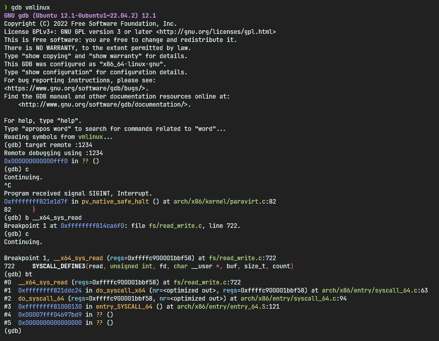
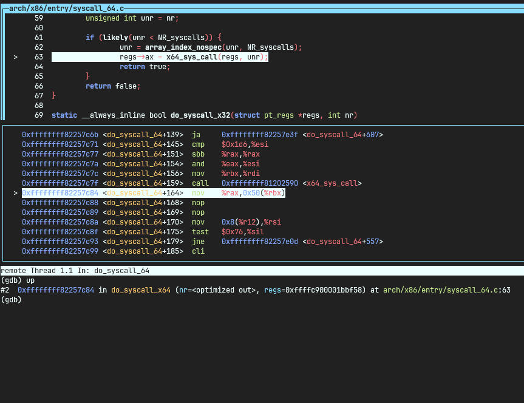

# Debug kernel: GDB + QEMU monitor

## Build Debug kernel

To enable debugging our kernel with GDB we need to build our kernel with [DWARF](https://dwarfstd.org/) debug information.

```bash
pushd linux-6.17.8

make menuconfig
```

Enable `DEBUG_INFO_DWARF4`:

```
-> Kernel Hacking
    -> Compile-time checks and compiler options
        -> Debug Information (<choice>)
            -> Generate DWARF Version 4 debuginfo (DEBUG_INFO_DWARF4 [=y])
```

This should also enable `DEBUG_INFO_COMPRESSED_NONE` but just in case:

```
-> Kernel Hacking
    -> Compile-time checks and compiler options
        -> Compressed Debug information (<choice>)
            -> Don't compress debug information (DEBUG_INFO_COMPRESSED_NONE = [y])
```

In case you get lost in the dialog menu, search for `DEBUG_INFO` with `/`.

For reference, these are the enabled `DEBUG_*` options in my `.config`:

```bash
$ rg DEBUG .config  | rg -v '^\s*#'
CONFIG_CGROUP_DEBUG=y
CONFIG_X86_DEBUGCTLMSR=y
CONFIG_PM_DEBUG=y
CONFIG_PM_SLEEP_DEBUG=y
CONFIG_ACPI_DEBUG=y
CONFIG_ARCH_SUPPORTS_DEBUG_PAGEALLOC=y
CONFIG_BLK_DEBUG_FS=y
CONFIG_DEBUG_DEVRES=y
CONFIG_PNP_DEBUG_MESSAGES=y
CONFIG_DEBUG_BUGVERBOSE=y
CONFIG_DEBUG_KERNEL=y
CONFIG_DEBUG_MISC=y
CONFIG_DEBUG_INFO=y
CONFIG_DEBUG_INFO_DWARF4=y
CONFIG_DEBUG_INFO_COMPRESSED_NONE=y
CONFIG_DEBUG_FS=y
CONFIG_DEBUG_FS_ALLOW_ALL=y
CONFIG_ARCH_HAS_EARLY_DEBUG=y
CONFIG_SLUB_DEBUG=y
CONFIG_ARCH_HAS_DEBUG_WX=y
CONFIG_DEBUG_WX=y
CONFIG_HAVE_DEBUG_KMEMLEAK=y
CONFIG_DEBUG_STACK_USAGE=y
CONFIG_ARCH_HAS_DEBUG_VM_PGTABLE=y
CONFIG_ARCH_HAS_DEBUG_VIRTUAL=y
CONFIG_DEBUG_MEMORY_INIT=y
CONFIG_LOCK_DEBUGGING_SUPPORT=y
CONFIG_DEBUG_BOOT_PARAMS=y
CONFIG_DEBUG_ENTRY=y
CONFIG_X86_DEBUG_FPU=y
```

Also enable `CONFIG_GDB_SCRIPTS`:

```
-> Kernel Hacking
    -> Compile-time checks and compiler options
        -> Provide GDB scripts for kernel debugging (GDB_SCRIPTS [=y])
```

Optionally, use FRAME_POINTER unwinding by enabling `UNWINDER_FRAME_POINTER`:

```
-> Kernel Hacking
    -> x86 Debugging
        -> Choose kernel unwinder (<choice>)
            -> Frame pointer unwinder (UNWINDER_FRAME_POINTER)
```

And finally enable `READABLE_ASM`

```
-> Kernel Hacking
    -> Compile-time checks and compiler options
        -> Generate readable assembler code (READABLE_ASM = [y])
```

Rebuild the kernel:

```bash
make clean
make -j12

popd
```

To make our life easier, it's best to add our user to the kvm group.

```bash
sudo usermod -aG kvm ${USER}
```

## Attach GDB to QEMU monitor

Now boot the kernel with the CPU waiting for GDB and allow remote GDB debugging:

```bash
qemu-system-x86_64 \
    -kernel linux-6.17.8/arch/x86/boot/bzImage \
    -initrd initramfs.cpio.gz \
    -append "console=ttyS0 rdinit=/sbin/init nokaslr" \
    -device virtio-net,netdev=n0 \
    -netdev user,id=n0 \
    -nographic \
    -enable-kvm \
    -cpu host \
    -s -S
```

Extra flags:

- `-s` - Do not start CPU, wait for GDB
- `-S` - shorthand for `-gdb tcp::1234` expose a remote GDB session on TCP port `1234`

Also note the `nokaslr` parameter to `-append`. This disables KASLR (kernel address space layout randomization)
so that our debug information can line up with the loaded kernel.

Now start gdb. In a separate terminal:

```
cd kernel-workspace/linux-6.17.8

gdb vmlinux
```

Now in the gdb shell, connect to our QEMU monitor:

```
target remote :1234
c
```

> Set the breakpoint after connecting.

Now interrupt by pressing CTRL+C to set a breakpoint at the `read` system call and continue:

```
<CTRL+C>
b __x64_sys_read
c
```

Now in the QEMU terminal, try pressing `<ENTER>` to trigger a `read` system call by `/bin/sh`

This should trap execution at the next invocation of the `read` system call.

From there you can run `bt` to see the backtrace.

<p align="center">

</p>

View the disassembly and source code side by side with `disassemble` and then `layout split`:

<p align="center">

</p>

Press CTRL+D in GDB to exit.

> Note that the FRAME_POINTER unwinder is slower than the ORC unwinder selected by default. When\
> we use tracing tools native to the kernel later on, we will use the ORC unwinder.
