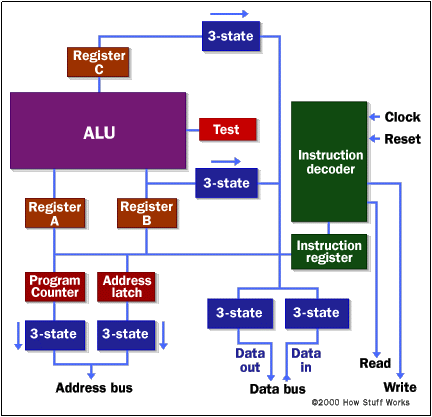
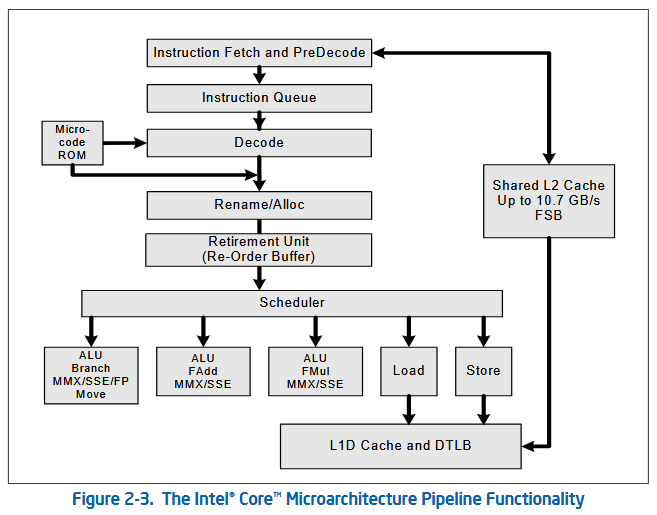
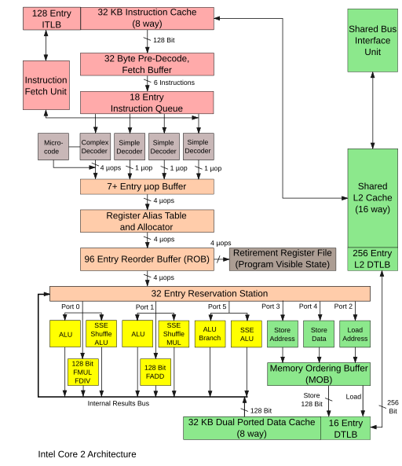
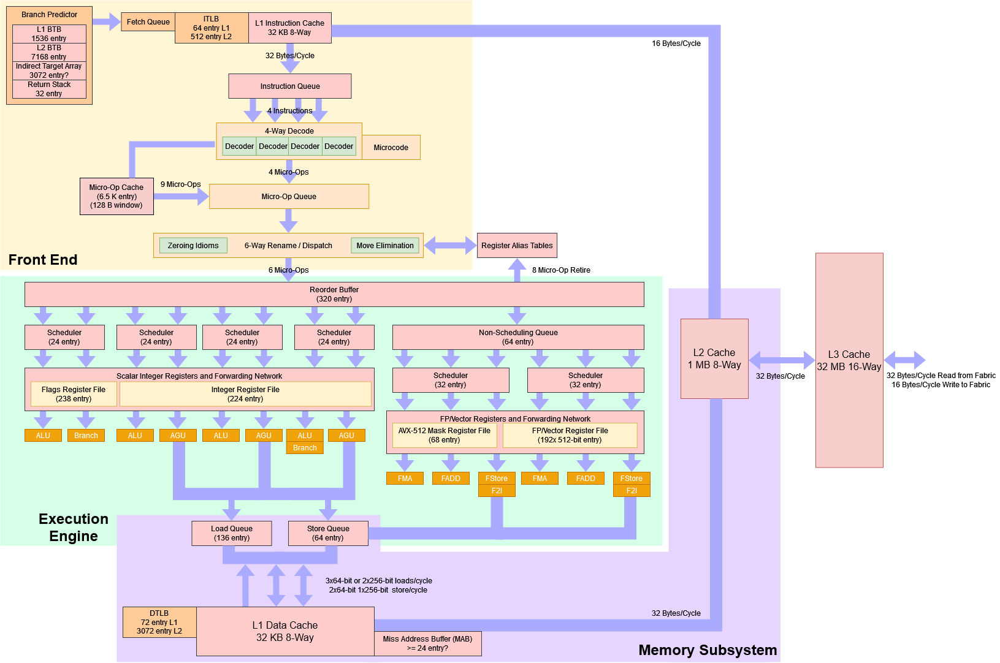

# A Brief description of CPU architecture

<p align="center">

<p align="center">Fig: High Level Von Neumann architecture diagram</p>
</p>

> In the traditional Von Neumann architecture, the Control Unit drives the
> execution. It fetches instructions and operands from memory, dispatches
> arithmetic instructions to the ALU for execution and writes back the
> result to memory.
>
> CPUs are a physical implementation of this abstract architecture.

At its heart, every CPU is a digital circuit. It relies on binary inputs and
binary outputs. To move these binary signals, the CPU interfaces with the System
Bus which contains the Address, Control and Data bus. The Control Unit places
the target address on the Address Bus, issues commands on the Control Bus,
and receives the binary code via the Data Bus. The CPU uses registers to store
operands and results from instructions which are in turn sequential digital
circuits capable of storing data.

So whenever we need the CPU to:

- Perform some arithmetic operation with its Arithmetic Logical Unit
- Perform Memory Read/Write or move data between registers

We need to pass in a specific binary coded instruction that the digital circuit
uses as the input to activate the relevant digital circuit components to perform
the side effects.

<p align="center">
<a title="Processor Architecture (cs.stanford.edu)" href="https://cs.stanford.edu/people/eroberts/courses/soco/projects/2005-06/64-bit-processors/whatis2.html">

</a>

<p align="center">Fig: High Level CPU architecture diagram</p>
</p>

<details>
<summary>
3-State Logic (click to expand)
</summary>

> **3-State Logic**
>
> While standard digital logic relies on two voltage states (0 and 1), the shared
> nature of the System Bus necessitates a third state: High Impedance (High-Z) to
> manage the bidirectional flow of data. This High-Z or Hi-Z state effectively
> disconnects a component from the circuit, acting electrically as if the wire
> were physically cut or an open switch.
>
> The 3 states:
>
> 1. Logic Low (0): The output connects to Ground (0V).
> 2. Logic High (1): The output connects to the Power Voltage (e.g., 3.3V or 5V).
> 3. High Impedance (Hi-Z): The output effectively disconnects itself from the circuit.
>
> Because the CPU and RAM share the same physical wires for the Data Bus, a conflict
> arises if one tries to push a high voltage (1) while the other pushes a
> low voltage (0). This would create a short circuit and potentially damage
> the hardware.
>
> To prevent this, the Control Unit uses 3-state logic:
>
> - When Reading: The CPU sets its data pins to Hi-Z (disconnected). This allows the RAM to "drive" the bus voltages without interference.
> - When Writing: The CPU drives the bus (1s and 0s), and the RAM sets its pins to Hi-Z.

</details>

<details>
<summary>
Program Counter (PC) (click to expand)
</summary>

> **Program Counter (PC)**
>
> The Program Counter (often called the Instruction Pointer or IP) is the register
> that tracks the memory address of the next instruction to be executed.
>
> - Classic Role: In simpler architectures, it strictly dictates the fetch step.
>   The CPU reads the address in the PC, fetches that exact instruction,
>   executes it, and then increments the PC.
> - Modern Analog: Architectural RIP register. On modern high-performance CPUs
>   (like x86_64), the concept of "current execution" is fluid due to Speculative Execution.
>   The hardware fetch unit often races far ahead of the actual Program Counter,
>   guessing which branches will be taken to preload instructions. The RIP essentially
>   tracks the "committed" state i.e the guaranteed, non-speculative path of the software.

</details>

<details>
<summary>
Address Latch (click to expand)
</summary>

> **Address Latch**
>
> The Address Latch is a circuit used to capture and hold a memory address signal
> constant for a specific duration, allowing the CPU to move on to other tasks
> while the slower memory subsystem processes the request.
>
> - Classic Role: Historically, this was a discrete chip on the motherboard. It was
>   required because older CPUs often shared the same physical wires for both
>   addresses and data (multiplexing). The latch would "memorize" the address
>   so the wires could be freed up to transfer the data.
> - Modern Analog: Integrated Memory Controller (IMC). The discrete latch chip
>   has been absorbed into the CPU die itself. The IMC manages all timing and
>   buffering internally. In enterprise-grade hardware, this specific latching
>   function re-emerges on RDIMM (Registered Memory) modules, where a dedicated
>   RCD (Registering Clock Driver) chip sits on the RAM stick to buffer address signals for stability.

</details>

A CPU is a synchronous sequential digital circuit with combinatorial components
constructed from these four core components:

- The clock
- Registers
- The Arithmetic Logic Unit (ALU)
- The Control Unit

> The CPU also interfaces with memory and storage through the system bus.

The following sections cover these components in detail.

## The Clock

The Clock is the heartbeat of the CPU. It provides a continuous, oscillating
electrical signal that alternates between low (0) and high (1) voltage states.
It is what makes the CPU a synchronous circuit. The speed of this transition is
the clock frequency (measured in GHz).

It coordinates the timing of all operations. Internal components like registers
only update their data on a specific edge of the clock signal (usually the
rising edge). This ensures that data is stable before it is processed or stored,
preventing race conditions where signals might arrive at different times.

## Registers

Registers are the fastest form of memory in the computer, physically located
within the CPU die. They are constructed from sequential logic circuits
(flip-flops) that hold binary data as long as power is applied.

- General Purpose Registers (GPRs): In x86_64, these are 64-bit wide storage
  locations (like RAX, RBX, RCX) used to hold variables and temporary results
  during calculations.
- Special Purpose Registers: These track the machine's state. Key examples
  include the Instruction Pointer (RIP) which tracks the current code location,
  and the Stack Pointer (RSP) which manages function call memory.

## The Arithmetic Logic Unit

The ALU is a purely combinatorial circuit. It performs the actual data
processing. It has no internal memory of past operations; its output is
determined solely by its current inputs.

- Arithmetic: Performs integer addition, subtraction, multiplication, and
  division.
- Logic: Performs bitwise operations like AND, OR, XOR, and NOT.
- Interaction: When the ALU computes a result (e.g., subtracting two numbers),
  it simultaneously updates the Status Register (RFLAGS) to reflect the outcome
  (e.g., setting the Zero Flag if the result was 0) and places the result on
  the destination register.

## The Control Unit

The control unit is a sequential circuit which relies on the Clock to act as a
Finite State Machine to go through the following stages:

- **Fetch**: Fetch the next instruction binary code. The CPU's **Bus Interface Unit**
  (BIU) orchestrates this process. It first checks the high-speed L1 Instruction
  Cache. If the data is not found, it cascades the check to the L2 and L3
  Caches. If a Cache Miss occurs at all levels, the CPU must retrieve the data
  from Main Memory (RAM). This triggers a physical hardware transaction across
  the System Bus, which is actually composed of three distinct sets of wires
  working in unison:

  - Addressing: The BIU reads the 64-bit address currently held in the
    Instruction Pointer (RIP). It places this specific binary address onto the
    Address Bus. This is a unidirectional channel that electrically signals the
    Memory Controller exactly where to look in the physical RAM grids.
  - Signaling: Simultaneously, the Control Unit asserts the Memory Read (MEMR)
    signal on the Control Bus. This line goes "active" (high or low voltage
    depending on the circuit logic) to tell the system memory that this is a
    retrieval operation, not a write operation. If the RAM is slower than the
    CPU, the memory controller may use the Control Bus to send a WAIT signal,
    forcing the CPU to pause (insert wait states) until the data is ready.
  - Transfer: Once the RAM locates the requested data, it places the binary
    values onto the Data Bus. Unlike the Address Bus, this is bidirectional. The
    memory usually sends a full Cache Line (often 64 bytes) rather than just the
    single instruction, filling the caches for future efficiency. The CPU senses
    the voltage changes on these wires, latches the data, and moves it into the
    Instruction Register (IR) or the Instruction Queue to await decoding.

  > The size of the memory address is what
  > determines the 64-bit in 64-bit architecture. So a 64-bit architecture uses
  > 64-bit wide memory addresses. A 32-bit architecture used 32-bit wide memory
  > addresses.
  >
  > Every memory address points to a byte of memory.
  >
  > A highest possible value of an unsigned 32-bit value is:
  >
  > ```
  > pow(2, 32)
  > = pow(2, 2) * pow(2, 10) * pow(2, 10) * pow(2, 10)
  > = pow(2, 2) * pow(2, 10) * pow(2, 10) * 1K
  > = pow(2, 2) * pow(2, 10) * 1M
  > = pow(2, 2) * 1G = 4 * 1G = 4G
  >
  > Every memory address points to 1 byte i.e 1B.
  >
  > So max memory addressable by 32-bit architecture = 4G * 1B = 4GB
  >
  > ```
  >
  > This is why 32-bit systems could not traditionally use more than 4GB or memory
  > since this is a mathematical limit. That said, specific hardware features
  > like [Physical Address
  > Extension](https://en.wikipedia.org/wiki/Physical_Address_Extension)
  > alleviated this to a certain extent.

- **Decode**: Decode the instruction and examine the Status Register. This register,
  known as RFLAGS on x86_64, holds the current state of the processor. Key flags
  include:

  - Zero Flag for equality
  - Sign Flag for negative results
  - Carry Flag for unsigned arithmetic errors,
  - Overflow Flag for signed arithmetic errors
  - Parity Flag for error checking
  - Direction Flag for string processing order
  - Interrupt Flag which controls response to external hardware signals.

- **Execute**: Activate the specific circuits to perform the operation.

  - If the instruction is a conditional branch,
    - the control unit uses these flag values to determine if the condition is
      met.
    - If true, it updates the Instruction Pointer to the new target address.
    - If false, it ignores the jump and allows the Instruction Pointer to
      increment to the next sequential instruction
  - If the instruction involves arithmetic it dispatches it to the ALU.
    - If it only involves registers, we send it to ALU and wait for results on destination register.
    - If it involves memory access, e.g. offsetting from a base memory address i.e adding
      some offset to a base memory address, this address addition is done on the ALU and
      the result address is stored on the register. The actual memory read or write back
      happens after that.
  - If the instructions doesn't involve arithmetic, the ALU is skipped.

- **Memory Access**: Read from or Write to memory.

  - Reading (Load):

    - The CPU first checks the L1 Data Cache. If the data is present (Cache Hit), it is read immediately.
    - If not found (Cache Miss), the request cascades to L2, L3, and finally Main Memory.
    - Data is retrieved from memory in chunks called Cache Lines (typically 64 bytes). This utilizes
      spatial locality, loading not just the requested byte but also adjacent data,
      anticipating it will be needed soon.

  - Writing (Store):

    - Write-Back Cache Policy (Modern Standard): To maintain performance, modern CPUs do not usually
      write data directly to the slow Main Memory. Instead, they write to the cache and set a
      "Dirty Bit" for that specific cache line. This bit indicates that the data in the cache
      is newer than the data in RAM. The actual write to Main Memory is deferred until that
      cache line is "evicted" (removed to make room for new data).

    - Write-Through Cache Policy (Alternative/Legacy): In this simpler but slower approach,
      every write to the cache is simultaneously written to Main Memory. This ensures
      RAM is always up to date but generates significant traffic on the system bus.

  - Cache Coherence:
    - Since multiple cores may cache the same memory address, the CPU uses a coherence
      protocol (like MESI). If one core modifies a value (sets the Dirty Bit), it must signal
      all other cores to mark their copies of that address as "Invalid" to prevent
      them from using stale data.

- **Register Write Back**: Write back the result from this instruction to registers.

> Note: Memory access does both Read/Write with memory. Register Write Back only writes back
> to internal registers.

Let's understand this with a few example instructions:

```x86asm
;; Intel ASM syntax:
;; <opcode> <dst> <src>
;; <opcode> <label>

mov eax, ebx  ; Move from ebx to eax
              ; Fetch, Decode, Execute. No Memory access. Register Write Back.
              ; ALU skipped

cmp eax, ebx  ; Compare values in eax and ebx registers.
              ; Fetch, Decode, Execute. Uses ALU which
              ; Sets Zero Flag (Z) = 1 if eax == ebx.
              ; No Memory access and No Register Write back.

jne copy_10B  ; Branch instruction. Check Zero Flag.
              ; If Zero Flag (Z) = 0, i.e. eax != ebx then: jump to label "copy_10B"
              ; - Decode phase reads Zero Flag.
              ; - Execute phase updates instruction pointer RIP to point to address
              ;   of instruction with label "loop"
              ; If Zero Flag (Z) = 1, i.e. eax == ebx then: No operation (NOP)
              ; - RIP is left untouched and it increments as usual.

mov eax, dword ptr [ebx]    ; Copy 4 bytes from memory pointed to by the address
                            ; stored in register ebx.
                            ; Fetch, Decode, Execute, Memory access to read
                            ; value from memory.
                            ; Register Write back. ALU skipped.

mov eax, dword ptr [ebx+4]  ; Copy 4 bytes from memory pointed to by the address
                            ; stored in register ebx, offset positively by 4 bytes
                            ; Fetch, Decode, Execute. Address calculation done on ALU.
                            ; Memory Access to read value from calculated address to
                            ; register.
                            ; Register write back.

mov dword ptr [ebx-4], eax  ; Copy 4 bytes from register eax to memory address
                            ; stored in the register ebx offset negatively by 4 bytes.
                            ; Fetch, Decode, Execute. Address calculation done on ALU.
                            ; Memory access to write value from register to memory.
                            ; No Register Write back as no registers are written to.

;; Example to copy 10 bytes from 0x1000 (source address) to
;; 0x2000 (destination address)
copy_10B:
  mov esi, 0x1000 ; Set source address
  mov edi, 0x2000 ; Set destination address
  mov ecx, 10     ; Set count to 10 bytes
  rep movsb       ; Repeat the MOVSB instruction 10 times

                  ; MOVSB copies from memory to memory
                  ; REP checks if ECX == 0
                  ; Each iteration:
                  ; 1. Checks ECX. If 0, exit.
                  ; 2. Executes MOVSB (Read Mem[ESI], Write Mem[EDI]).
                  ; 3. Increments ESI/EDI, Decrements ECX.
                  ; 4. Updates RIP to point back to itself (until ECX=0).
```

> Note: This doesn't cover Data hazards like Read After Write (RAW) or Structural Hazards.
> Refer to the recommended books for more info.

## Modern x86_64 Optimizations

Modern processors expand on this foundation to maximize efficiency. They do not
wait for one instruction to finish completely before starting the next. Instead,
they use [Instruction
Pipelining](https://en.wikipedia.org/wiki/Instruction_pipelining) to treat the
Fetch, Decode, and Execute cycle like a factory assembly line. While one
instruction is being executed, the next is already being decoded, and a third is
being fetched.

<p style="margin-bottom:30px;"></p>

<p align="center">
<a title="Intel® 64 and IA-32 Architectures Software Developer’s Manual"
href="https://www.intel.com/content/www/us/en/developer/articles/technical/intel-sdm.html">

</a>
</p>

### The Standard 5-Stage Pipeline Model

To visualize how pipelining improves throughput, computer scientists often use a
generic 5-stage model. In a non-pipelined CPU, Instruction 2 cannot begin until
Instruction 1 completes all five stages (taking 5 clock cycles). In a pipelined
CPU, a new instruction enters the "assembly line" every clock cycle. The
important thing to note is, every pipeline stage can function independently
as long it has the necessary data to operate on.

**(Ideal) Pipeline Execution Table**

| #I    |  CC 1  |  CC 2  |  CC 3  |  CC 4  |  CC 5  | CC 6 | CC 7 | CC 8 | CC 9 |
| :---- | :----: | :----: | :----: | :----: | :----: | :--: | :--: | :--: | :--: |
| **1** | **IF** |   ID   |   EX   |  MEM   |   WB   |      |      |      |      |
| **2** |        | **IF** |   ID   |   EX   |  MEM   |  WB  |      |      |      |
| **3** |        |        | **IF** |   ID   |   EX   | MEM  |  WB  |      |      |
| **4** |        |        |        | **IF** |   ID   |  EX  | MEM  |  WB  |      |
| **5** |        |        |        |        | **IF** |  ID  |  EX  | MEM  |  WB  |

> Rows represent consecutive instructions. #I is the instruction number.
>
> Columns represent the clock cycle (CC).
>
> Every cell value represents the **Control Unit Pipeline Stage** _for_:
> a particular **Instruction**, _at_ a particular **Clock Cycle**.

In the table above, notice how at **CC 5**, the hardware is fully
saturated. Five different instructions are being processed simultaneously in
different stages in this 5th clock cycle.

**The 5 Pipeline Stages**

1. **Instruction Fetch (IF):**
   The CPU reads the instruction from the L1 Instruction Cache using the address
   in the Instruction Pointer (RIP). The IP is incremented to point to the next
   instruction.

2. **Instruction Decode (ID):**
   The Control Unit interprets the opcode bits to determine which circuits are
   needed. Simultaneously, the input operands are read from the Register File
   (e.g., reading values from `RAX` or `RBX`).

3. **Execute (EX):**
   The ALU performs the actual operation. This could be an arithmetic
   calculation (add, subtract) or calculating the effective address for a memory
   access (e.g., calculating `base + offset`).

4. **Memory Access (MEM):**
   If the instruction involves system memory (like a `MOV` instruction that
   reads from RAM), the data is read from or written to the data cache/memory
   during this phase. Arithmetic-only instructions effectively skip this step
   (idle).

5. **Write Back (WB):**
   The final result of the operation (from the ALU) or the data retrieved from
   memory is written back into the destination register in the Register File,
   making it available for future instructions.

> This is the ideal pipeline execution. In reality the control unit may choose
> to insert stalls or bypass register file to avoid data hazards. Refer to
> recommeneded books for more info.

<p style="margin-bottom:30px;"></p>

<p align="center">
<a title="I, Appaloosa, CC BY-SA 3.0 &lt;http://creativecommons.org/licenses/by-sa/3.0/&gt;, via Wikimedia Commons" href="https://commons.wikimedia.org/wiki/File:Intel_Core2_arch.svg"></a>
<p align="center">Fig: Intel Core Microarchitecture</p>
</p>

These processors are also Superscalar:

- The CPU contains multiple execution units to retire multiple instructions per
  clock cycle.
- To support this, the hardware uses [Register
  Renaming](https://en.wikipedia.org/wiki/Register_renaming) to map
  architectural registers like RAX to a larger pool of physical registers,
  removing false dependencies.
- Furthermore, [Out of Order
  Execution](https://en.wikipedia.org/wiki/Out-of-order_execution#Basic_concept)
  allows the CPU to process instructions as soon as their inputs are ready
  rather than waiting for previous unrelated tasks to finish.
- A [Reorder
  Buffer](https://cseweb.ucsd.edu/classes/fa14/cse240A-a/pdf/07/CSE240A-MBT-L13-ReorderBuffer.ppt.pdf)
  then ensures results are committed in the original program order.
- Finally, [Branch Prediction](https://en.wikipedia.org/wiki/Branch_predictor)
  logic guesses which path the code will take and speculatively executes
  instructions before the flags are even calculated to keep the pipeline full.

<p style="margin-bottom:30px;"></p>

<p align="center">
<a title="AMD Zen 4 architecture (courtesy Chips and Cheese on Substack)"
href="https://chipsandcheese.com/p/why-x86-doesnt-need-to-die">
</a>
<p align="center">Fig: AMD Zen 4 architecture (courtesy Chips and Cheese on Substack)</p>
</p>

> I recommend the following books for a deeper understanding:
>
> - Computer Systems a Programmer's Perspective (Randal E. Bryant, David R. O’Hallaron)
>   - Compares high level
>     C and assembly side by side and describes the execution process in detail
> - Computer Organization and Design: The Hardware Software Interface (Hennessy, Patterson)
>   - Provides an overview of the Pipelining process
> - Computer Architecture: A Quantitative Approach (Hennessy, Patterson)
>   - Goes into detail about pipelining, data dependencies, data hazards, structural hazards,
>     dynamic scheduling, branch prediction, Tomasulo's algorithm
> - Digital Design and Computer Architecture (David Money Harris and Sarah L. Harris)
>   - Goes into detail about the CPU is implemented at the digital circuit
>     level, down to the logic gates and transistors.
>
> I would also recommend this blog post:
>
> - [Why x86 Doesn’t Need to Die ~ Chester Lam on Chips and Cheese](https://chipsandcheese.com/p/why-x86-doesnt-need-to-die)
>   - The AMD Zen-4 architecture diagram is taken from this blog post
>   - Covers Out of order execution, CISC vs RISC tradeoffs, instruction
>     fetching and decoding performance analysis.

From this we can conclude that the following is unique for every architecture:

- The specific operations supported and their specific binary encoding i.e the
  _opcodes_
- The specific registers used in the architecture
- Architecture specific digital circuit implementation
- Architecture specific optimizations

Due to the above reasons, every architecture has its own set of instructions,
instruction invocation conventions and thereby its own ISA.

That said there are modern open standardized ISAs like RISCV which can then have
different implementations at the digital circuit level.

We can therefore, think of ISA as the **API interface** that an architecture
exposes for being programmed with.

In the next chapter, we will refer to the ["Intel® 64 and IA-32 Architectures
Software Developer’s Manual"](https://www.intel.com/content/www/us/en/developer/articles/technical/intel-sdm.html)
to know more about the available registers, instruction format and opcodes to
see how to write programs in assembly or machine code.
